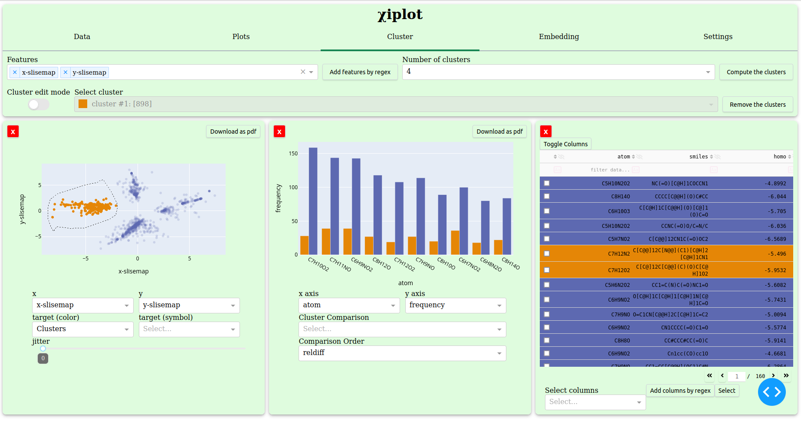
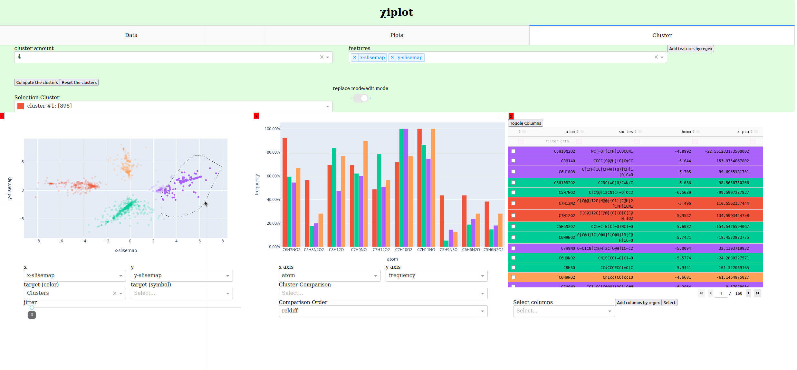
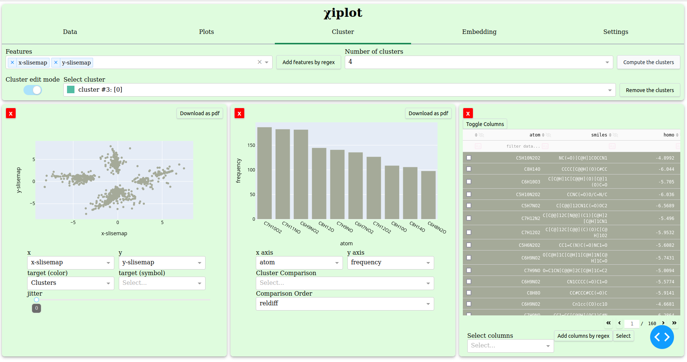
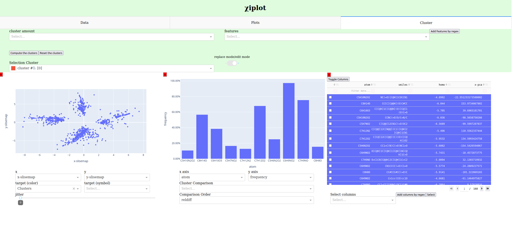

# Clustering

&chi;iplot has two ways to create clusters: by drawing on scatterplots or by input on "Cluster" tab.

There are also two modes to draw clusters: replace mode and edit mode.

## Cluster drawing

In order to draw clusters, the user needs to display a scatterplot first. After the scatterplot is displayed, 
there are two built-in features on Plotly's scatterplot to select points: Box Select and Lasso Select. After the selection, clusters are created.

### Replace mode

On the "Cluster" tab, there is a toggle to select replace mode or edit mode.

On the replace mode, "Selection Cluster" dropdown is pinned to the cluster #1.

When clusters are made on replace mode, selected points are set to cluster #1 and the rest are set to cluster #2.

.png)

### Edit mode

On the edit mode, the user can select a cluster from the "Selection Cluster" dropdown and add points to the cluster by drawing points from a scatterplot.

Cluster everything cannot be modified.

.png)

## Clustering by input

Go to the "Cluster" tab.

Select an amount of clusters to create.

Select features to calculate.

Click the "Compute the clusters" button.

.png)

"cluster amount" dropdown has integers from 2 to 9.

"features"  dropdown has only numeric columns of the dataset.

The user can add multiple features by giving a regular expression string to the "features" dropdown and clicking the "Add features by regex" button.

## Reset clusters

Click the "Reset the clusters" button to reset the clusters.

