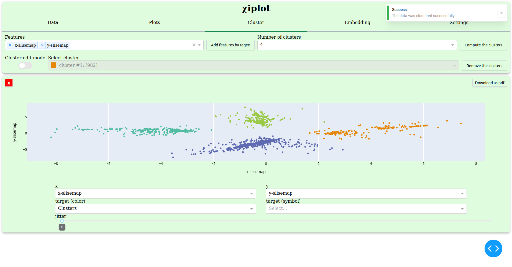
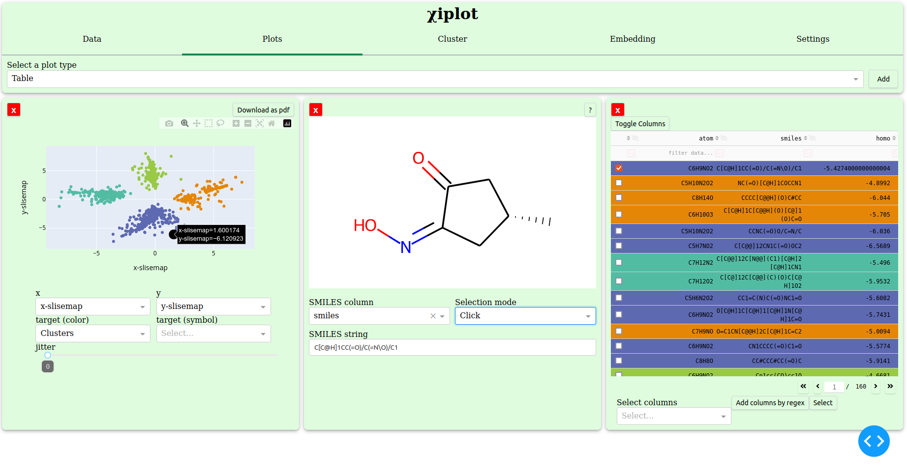
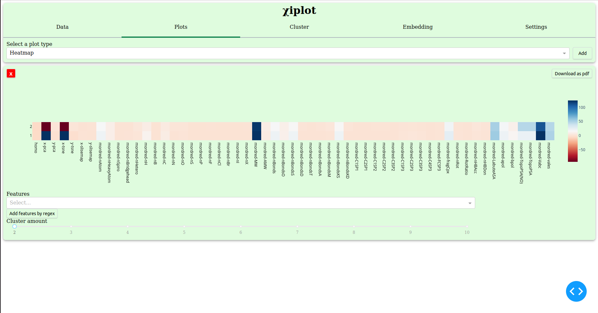
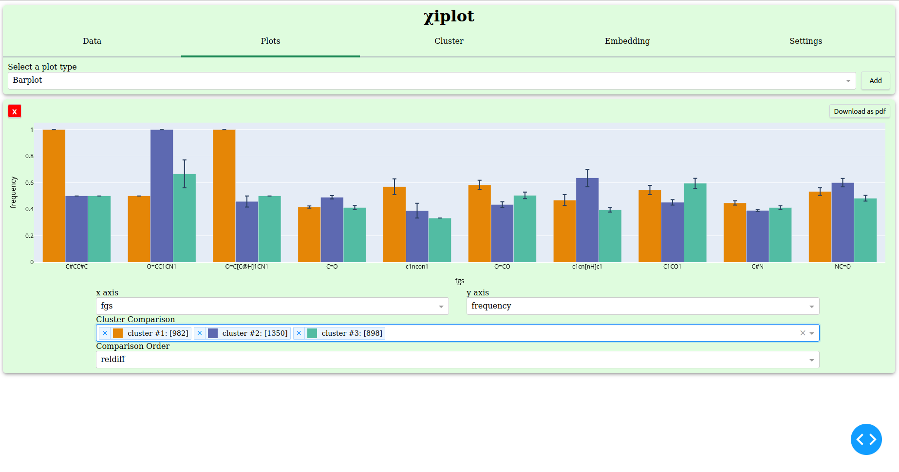
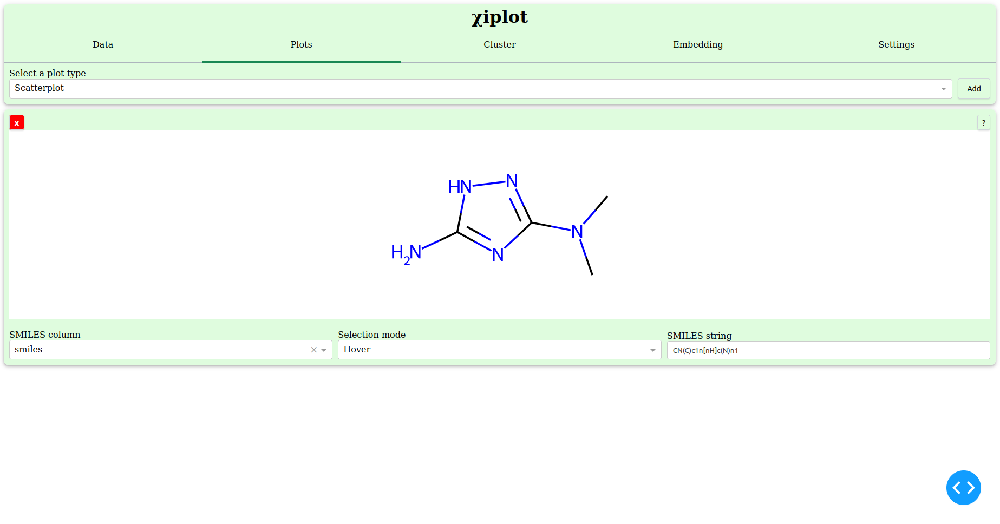

# Scatterplot

In &chi;iplot, scatterplots are playing the key role. They are connected to most of the other plots either directly (by hovering or clicking) or
indirectly (by drawing clusters).

## Control of scatterplots

There are four dropdowns and one slider in the control of the scatterplots.

The first two dropdowns change the axes of the scatterplot. The dropdowns have only columns, whose datatypes are numerical (e.g. a column weight is
numerical but a column car-name is not numerical).

The latter two dropdowns modify the color or the shape of the points of the scatterplot. The default value of the color dropdown is "Clusters".
(The scatterplot's color on the above image has not changed, since clusters are not created yet)

The slider in the bottom is for jittering. Jittering seperates the points from each other, so that overlapped points can be recognized.

## Hovering over points

If the dataset has a column for SMILES strings, the user can display stick structure of the molecule on the SMILES plot by hovering over points on
scatterplots. The dropdown value of the SMILES plot should be "hover".

## Click on points

As with the hovering, if the dataset has a column for SMILES strings, the stick structure is displayable by clicking on the points of the scatterplot.
The dropdown value of the SMILES plot should be "click".

In addition, when the user clicks a point on a scatterplot, the corresponding row on data tables is marked as selected and brought to 
the top of the data table. Clicked points are displayed larger than the other points and they are black.

## Clustering

See the 

# Histogram

## Control of histogram

There are two dropdowns in the control of a histogram.

The first dropdown changes the value of the x axis. The dropdown has only numerical columns as selectable options.

The second one is a multi-selectable dropdown, in which the user can select multiple clusters to display on the histogram. As a default and when the dropdown is empty, all clusters except the option "all" is displayed on the histogram.

# Heatmap

On the WASM version, if the user has not created any clusters before displaying a heatmap, it will take longer, since the `KMeans` package is lazy loaded, when the user is creating clusters for the first time.

## Control of heatmap

There is a slider in the control of a heatmap. It changes the amount of clusters to set. The default value is 2.

# Barplot

Barplot displays 10 highest bars on the barplot.

## Control of barplot

There are four dropdowns in the control of a barplot.

The first two dropdowns change the axes of the barplot. The dropdown of the x axis has all columns except float type columns. The dropdown of the y axis has only numerical columns and "frequency" by default value. "frequency" shows how often a particular value appears in a dataset.

The third dropdown is a multi-selectable dropdown, in which the user can select multiple clusters to display on the barplot. As a default and when the dropdown is empty, all clusters except the option "all" is displayed on the barplot.

The fourth dropdown changes the order of the bar groups.

"reldiff" is the relative difference of the bar groups. Ten highest relative difference bar groups are displayed.

"total" is the sum of the values of the bar groups. Ten highest total bar groups are displayed.

# Table

## Control of table

There are one dropdown and two buttons in the control of a table.

The dropdown is a multi-selectable dropdown, which has all the columns of the dataset and additionally "Clusters" column, if clusters have already made. By default, there are 5 columns in a table. The user can select all the columns to include in the table from the dropdown.

If the user wants to select multiple values to the dropdown at the same time, the user can use regular expression (regex). The user needs to type a regex string to the dropdown and click "Add columns by regex" button.

After adding all the wanted columns to the dropdown, the user can click "Select" button to recreate the table with the selected columns.

## Selecting rows

As written [above](#click-on-points), all the selected rows get a check mark and they are sent to the top of the table. When a new row is selected, the corresponding point on scatterplots become highlighted.

# SMILES plot

SMILES plot is connected with scatterplots and tables.

## Control of SMILES plot

There are two dropdowns and one input field in the control of a SMILES plot.

The input gets a SMILES string and convert it to a stick structure. If the input is invalid, the plot displays a red X mark.

"SMILES column" dropdown has a list of all columns of the given dataset that have string items. The user can set the column that has SMILES strings in order to use the SMILES plot with scatterplots.

"Selection mode" dropdown has two options: "hover" and "click".

- On "hover" mode, SMILES plot is displayed when the user hovers over the points on scatterplots or clicks a cell on the SMILES column of a table.

- On "click" mode, SMILES plot is displayed when the user clicks a point on a scatterplot or clicks a cell on the SMILES column of a table.

SMILES plots can be displayed from the input with any mode.

